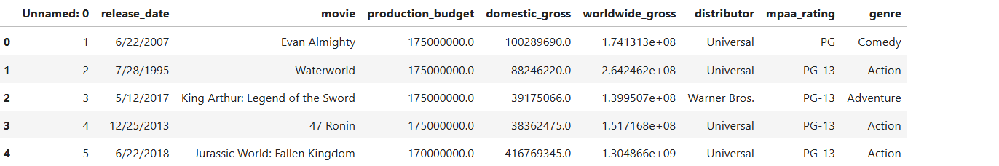
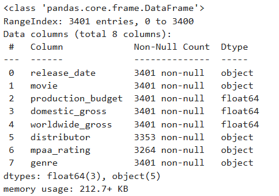
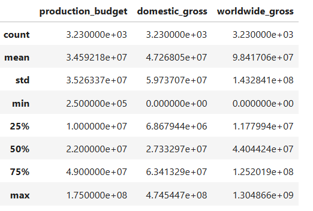
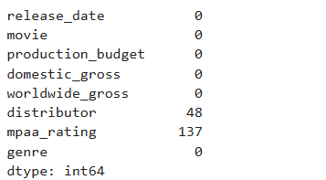
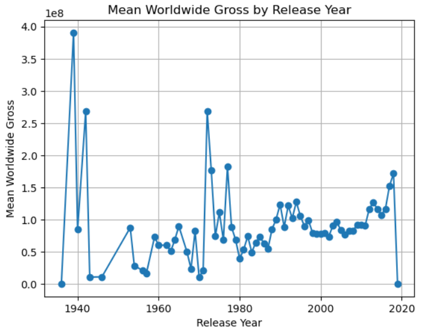
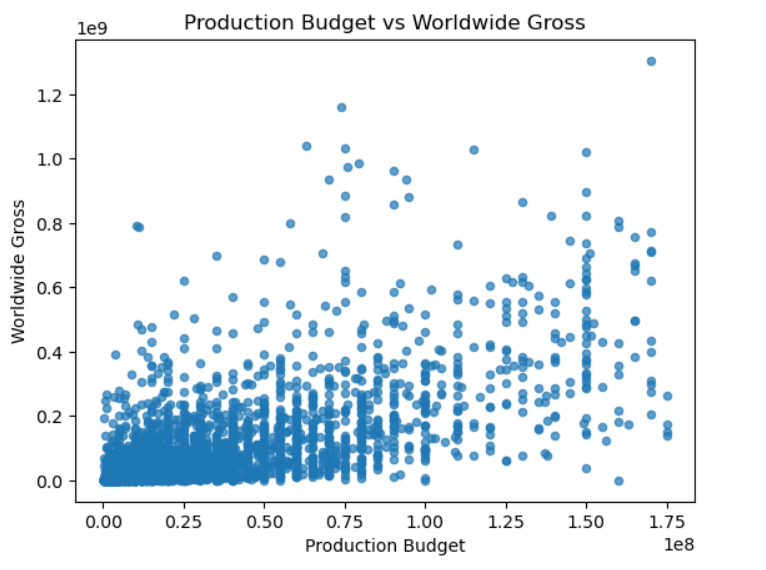
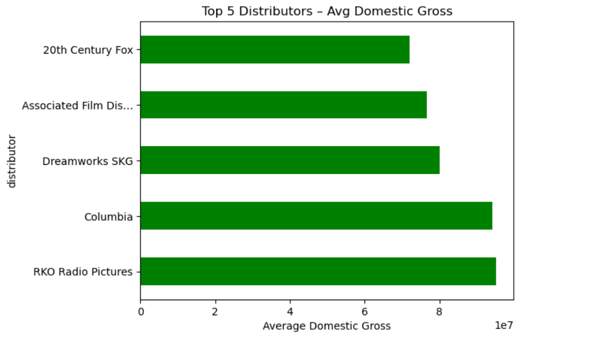

# 🎬 Movie Profitability Analysis – EDA Project

This project analyzes a dataset of movies to explore key profitability drivers such as production budget, revenues, distributor impact, genre-wise trends, and audience ratings.

> 📁 Dataset: Contains columns like `movie_title`, `genre`, `production_budget`, `domestic_gross`, `worldwide_gross`, `release_date`, `distributor`, `mpaa_rating`, and `runtime`.

---

## 🚀 Objective

To explore and visualize the relationship between movie features (like budget, rating, distributor) and their profitability using Python (Pandas, Matplotlib, Seaborn).

---

## 🧼 Data Cleaning & Initial Exploration

### ✅ Top 5 Rows  


### ✅ Dataset Info (dtypes, nulls)  


### ✅ Summary Statistics  


### ✅ Null Count Before & After Cleaning  


---

## 📊 Exploratory Data Analysis (EDA)

### 🎭 Genre Distribution  
`df['genre'].value_counts()`  


### 🎞️ MPAA Rating Distribution  
`df['mpaa_rating'].value_counts()`  


### 💰 Histogram of Worldwide Gross  
`df['worldwide_gross'].plot(kind='hist')`  


### 🎨 Bar Chart: Total Budget by Genre  
Grouped bar chart of total production budget per genre  


### 🍿 Pie Chart: Domestic Gross by Rating  
Shows how much each MPAA rating contributed to domestic gross  


### 📈 Line Chart: Mean Worldwide Gross per Year  
Tracks average worldwide gross of movies over the years  


### 🔁 Line Chart: Mean Gross by New Year Column  
Line plot based on extracted `release_year` column  


### 📉 Scatter Plot: Budget vs Worldwide Gross  
Relationship between production budget and worldwide gross  


### 🏢 Top 5 Distributors by Revenue  
Horizontal bar chart of top-grossing distributors  


### 🔍 Correlation Heatmap  
`df.corr(numeric_only=True)`  


---

## 🛠️ Tools Used

- Python  
- Jupyter Notebook  
- Pandas  
- NumPy  
- Seaborn  
- Matplotlib  

---

## 📂 Folder Structure

```
Movie-Profitability-EDA/
│
├── movie_profit_EDA.ipynb
├── README.md
└── images/
    ├── df_head.png
    ├── df_info.png
    ├── df_describe.png
    ├── df_isnull.png
    ├── genre_value_counts.png
    ├── rating_value_counts.png
    ├── worldwide_gross_hist.png
    ├── budget_by_genre.png
    ├── domestic_by_rating_pie.png
    ├── mean_gross_by_year.png
    ├── release_year_line.png
    ├── scatter_budget_vs_gross.png
    ├── top5_distributors.png
    └── heatmap.png
```

---

## 📌 Summary

This EDA project gives a clear understanding of the movie industry trends by analyzing revenue, budgets, and factors impacting a movie's success.

> Ideal for portfolio demonstration, beginner-friendly EDA walkthroughs, or analytical storytelling with visual support.
